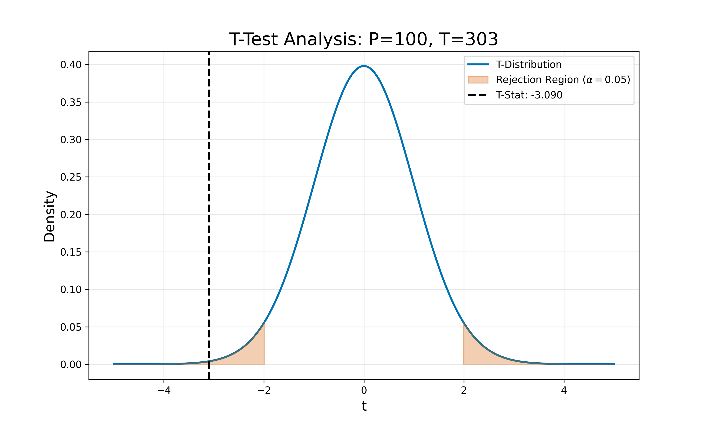
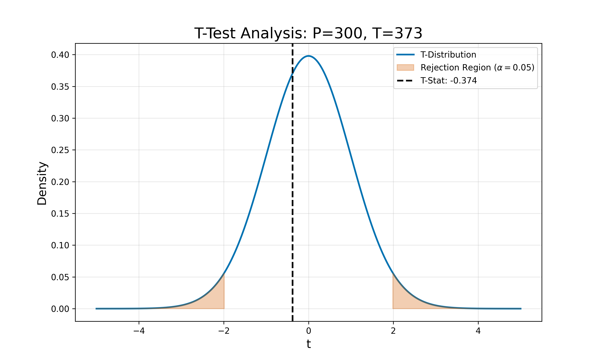

:::: {.columns}
::: {.column width="50%"}

## Sample slides
#### PlaceHolderName
#### Universiti Malaysia Perlis
#### [placeholder@email.com](mailto:placeholder@email.com)

<!-- __AUDIO_INTRO_DO_NOT_TOUCH__ -->

:::

::: {.column width="50%"}

:::

::::

---

:::: {.columns}
::: {.column width="50%"}
### Slide one
**Key Concepts:**
- Energy conservation per @carnot1824.
- $\Delta U = Q - W$
:::

::: {.column width="50%"}

:::
::::

---

---

:::: {.columns}
::: {.column width="50%"}
### The Master Equation
The fundamental relation of thermodynamics:

$$\Delta U = Q - W$$

The work done $W$ is positive when the system expands against an external pressure.
:::

::: {.column width="50%"}
<video data-src="media/videos/sample.mp4" data-autoplay loop muted width="100%"></video>
:::

::::

---

:::: {.columns}
::: {.column width="50%"}
### Visualizing the Gas Law
**Interactive Model:**

- P, V, and T relationships.
- Use the slider to adjust pressure.
- Observe the phase boundary.
:::

::: {.column width="50%"}
<iframe 
  data-src="media/plots/sample.html" 
  width="100%" 
  height="500px" 
  style="border:none;" 
  scrolling="no">
</iframe>
:::
::::

---

:::: {.columns}
::: {.column width="50%"}
### Machine 1 Control Analysis
**Parameters:**
- Pressure: 200kPa
- Temp: 338K

**Observations:**
- Individual measurements monitored against statistical limits.
- Control limits calculated at $\pm 3\sigma$.
:::

::: {.column width="50%"}
<iframe data-src='media/plots/m1_control.html' width='100%' height='500px' style='border:none;'></iframe>
:::
::::

---

:::: {.columns}
::: {.column width="50%"}
### Machine 1 Capability
**Specifications:**
- LSL: 48.0
- USL: 52.0

**Statistics:**
- **Calculated $C_{pk}$: 1.420**
- Assessment: **CAPABLE**

Process is capable and stable.
:::

::: {.column width="50%"}
<iframe data-src='media/plots/m1_cap.html' width='100%' height='500px' style='border:none;'></iframe>
:::
::::

---

:::: {.columns}
::: {.column width="50%"}
### Machine 2 Control Analysis
**Parameters:**
- Pressure: 200kPa
- Temp: 338K

**Observations:**
- Individual measurements monitored against statistical limits.
- Control limits calculated at $\pm 3\sigma$.
:::

::: {.column width="50%"}
<iframe data-src='media/plots/m2_control.html' width='100%' height='500px' style='border:none;'></iframe>
:::
::::

---

:::: {.columns}
::: {.column width="50%"}
### Machine 2 Capability
**Specifications:**
- LSL: 48.0
- USL: 52.0

**Statistics:**
- **Calculated $C_{pk}$: 0.850**
- Assessment: **NOT CAPABLE**

Process requires intervention/centering.
:::

::: {.column width="50%"}
<iframe data-src='media/plots/m2_cap.html' width='100%' height='500px' style='border:none;'></iframe>
:::
::::

---

:::: {.columns}
::: {.column width="50%"}
### Machine 3 Control Analysis
**Parameters:**
- Pressure: 200kPa
- Temp: 338K

**Observations:**
- Individual measurements monitored against statistical limits.
- Control limits calculated at $\pm 3\sigma$.
:::

::: {.column width="50%"}
<iframe data-src='media/plots/m3_control.html' width='100%' height='500px' style='border:none;'></iframe>
:::
::::

---

:::: {.columns}
::: {.column width="50%"}
### Machine 3 Capability
**Specifications:**
- LSL: 48.0
- USL: 52.0

**Statistics:**
- **Calculated $C_{pk}$: 0.850**
- Assessment: **NOT CAPABLE**

Process requires intervention/centering.
:::

::: {.column width="50%"}
<iframe data-src='media/plots/m3_cap.html' width='100%' height='500px' style='border:none;'></iframe>
:::
::::

---

:::: {.columns}
::: {.column width="50%"}
### Slide 13
T-Test Visualization
(P=100, T=303)

**Visual Indicators:**
- Red areas: Rejection region
- Dashed line: Observed $t$-statistic
:::

::: {.column width="50%"}

::: 
::::

---

:::: {.columns}
::: {.column width="50%"}
### Slide 14
Statistical Metrics
(P=100, T=303)

**Test Results:**
- $t$-statistic: -3.0903
- $p$-value: 0.0026
- $df$: 98
:::

::: {.column width="50%"}

::: 
::::

---

### Slide 15
Condition Assessment

**Question:** Is there a true difference between Machine 1 and Machine 2 at P=100, T=303?

**Decision ($lpha=0.05$):**
- **Output: Yes**

*Note: Result based on independent two-sample t-test comparing measurements.*

---

:::: {.columns}
::: {.column width="50%"}
### Slide 16
T-Test Visualization
(P=300, T=373)

**Visual Indicators:**
- Red areas: Rejection region
- Dashed line: Observed $t$-statistic
:::

::: {.column width="50%"}

::: 
::::

---

:::: {.columns}
::: {.column width="50%"}
### Slide 17
Statistical Metrics
(P=300, T=373)

**Test Results:**
- $t$-statistic: -0.3739
- $p$-value: 0.7093
- $df$: 98
:::

::: {.column width="50%"}

::: 
::::

---

### Slide 18
Condition Assessment

**Question:** Is there a true difference between Machine 1 and Machine 2 at P=300, T=373?

**Decision ($lpha=0.05$):**
- **Output: No**

*Note: Result based on independent two-sample t-test comparing measurements.*
